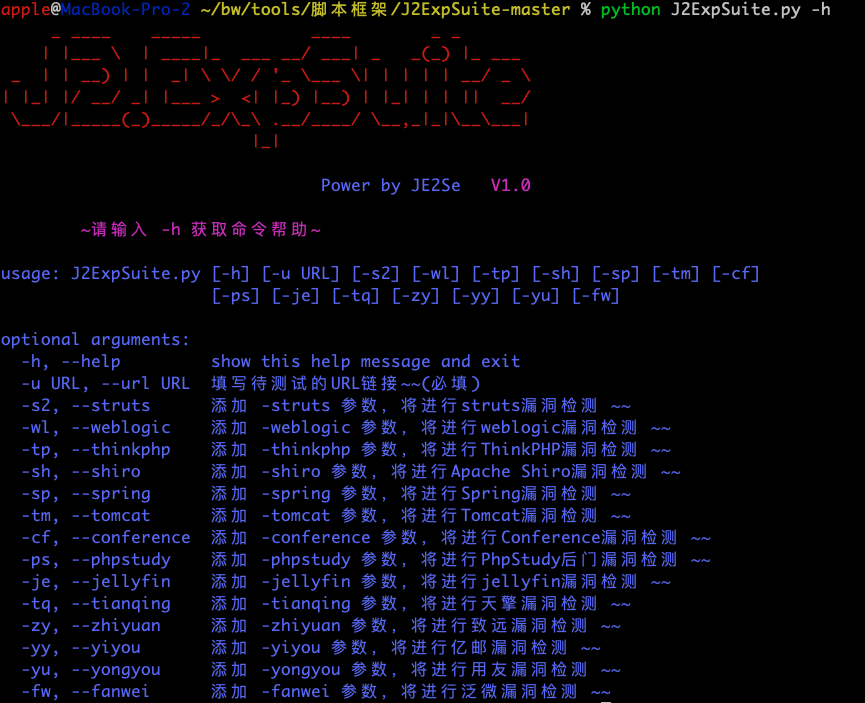
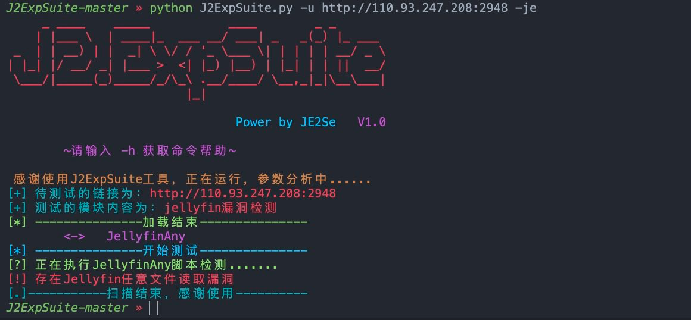
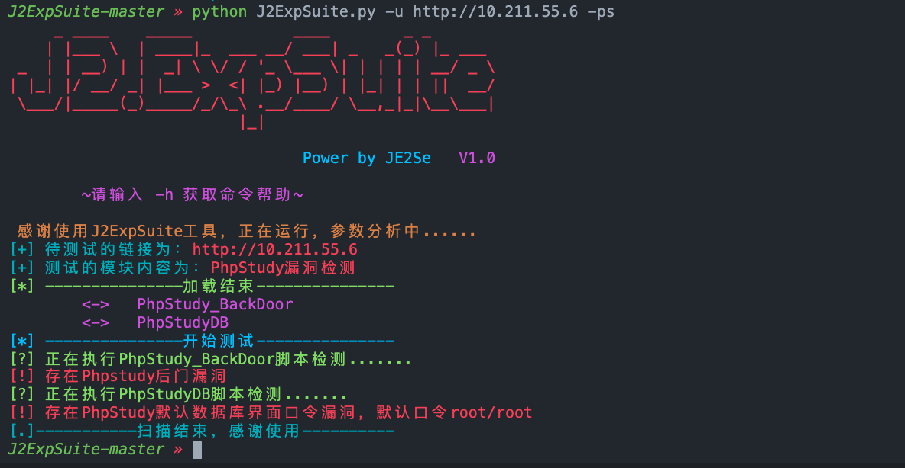
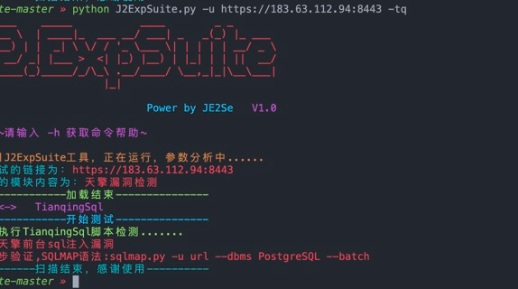
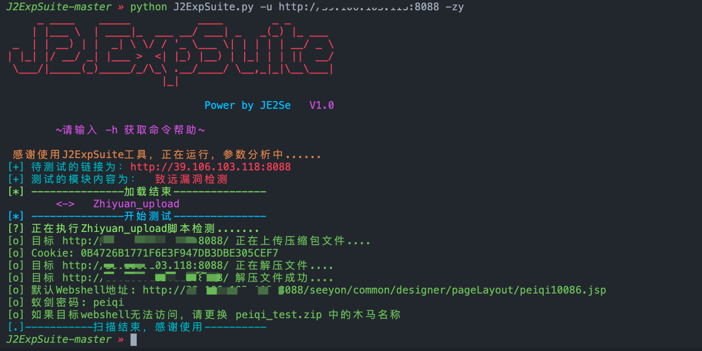

# J2ExpSuite 漏洞检测框架
## 说明
本来要自己写个脚本存放poc，发现有大佬已经写了个[J2ExpSuite](https://github.com/JE2Se/J2ExpSuite)，后期添加POC


### 脚本启动



### 部分漏洞利用










## 目前支持漏洞

| 框架/组件/中间件 |
|-----------|
| Phpstudy  |
| jellyfin  |
| tianqing  |
| weblogic  |
| fanwei    |
| yongyou   |
| qizhi     |
| yiyou     |
| zhiyuan   |
| tomcat    |


## POC编写规范

### POC格式解析

```python

# encoding: utf-8
from lib import *
import logging
from lib.Urldeal import umethod

def XXX_POC(Url): #必须与脚本名称相同
    scheme, url, port = umethod(Url) #URL处理，拆分初协议
    
    #-----------POC部分，下，按需更改--------------------
    urldata = scheme + "://" + url + ':' + str(port) + '/login.action
    
    try:
        if "漏洞判断成功条件":
    #-----------POC部分，上，输出部分--------------------
            print(Vcolors.RED +"[!] 存在【漏洞名称】漏洞->版本号:什么漏洞\r" + Vcolors.ENDC)
    except:
        logging.error("【脚本名称】脚本出现异常")

```

函数名称需要与脚本名称一致，编写后直接将POC脚本放入对应的路径下就行
### 新增检查项
如新添加OA检测
#### 主文件```J2ExpSuite.py```
在主文件```J2ExpSuite.py```文件中添加索引

```parser.add_argument("-oa", "--oa", help='添加 -oa 参数，将进行OA相关相关漏洞检测  ~~', action='store_true')```

主文件```J2ExpSuite.py```文件中添加执行
 ```python
 if args.oa:
    print(Vcolors.CYAN + "[+] 测试的模块内容为：" + Vcolors.ENDC + Vcolors.RED + "OA相关漏洞检测" + Vcolors.ENDC)
    OAScan(url)
 ```
#### 目录
在exphub内创建oa目录（建议小写统一规范）内部新建```__init__.py```，以及```OAScan.py```

#### ```OAScan.py```

先看代码

```python
from lib.ModelLoad import ONLoad
from lib import *
import os
import logging

dlist = []
#文件遍历
def OAScan(url):  #函数名与文件名相同，建议为大写字母加上Scan
    for file in os.listdir("./exphub/oa/"):  #修改此处为路径名称，建议为小写
        if os.path.splitext(file)[1] == '.py':
            if os.path.join(file) != "__init__.py" and os.path.join(file) != "OAScan.py":     #排除init文件以及主扫描文件OAScan.py文件
                dlist.append(os.path.join(os.path.splitext(file)[0]))
    ONLoad(dlist)
    try:
        for defclass in dlist:
            print(Vcolors.OKGREEN + "[?] 正在执行" + defclass + "脚本检测.......\r" + Vcolors.ENDC)
            exec("from exphub.oa.{0} import {1}".format(defclass, defclass))   #此处修改导入的exphub.路径信息
            defclass += "(url)"
            exec(defclass)
    except:
        logging.error("OAScan脚本出现异常")  #修改异常监控名称
```

#### ```__init__.py```OA路径

```python
from exphub.oa.OAScan import OAScan  #导入文件名称，导入函数名称
```
#### ```__init__.py```exphub路径

```python
from exphub.oa import *  #导入函数名称
```


